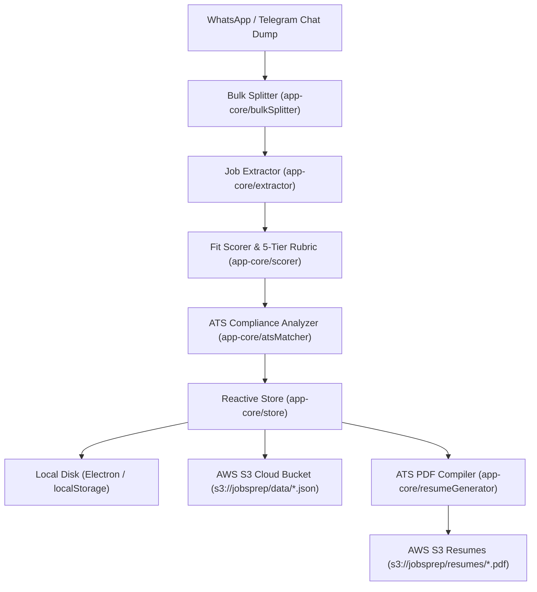

# PLAN.md — JobRadar (Standalone Windows Desktop Architecture)
> Created: 2026-08-11 · Last updated: 2026-08-17
> Status: SHIPPED & OPERATIONAL (Zero-Backend Electron Desktop + Direct AWS S3)

---

## 1. Project Structure

```
Job Hunt/
├── CLAUDE.md                          # Project guidance & instructions
├── LICENSE                            # MIT License
├── README.md                          # Full project documentation & guide
├── package.json                       # Electron, Vite, React 18, S3 SDK scripts
├── tsconfig.json                      # Strict TypeScript compiler options
├── vite.config.ts                     # Vite build configuration
├── tailwind.config.js                 # Custom dark theme tokens
├── .env.example                       # S3 and API keys template
├── .github/
│   └── workflows/ci.yml               # GitHub Actions CI workflow (typecheck, build, test)
├── config/
│   ├── profile.json                   # Candidate profile and skills
│   ├── master_resume.tex              # Master FAANG/Overleaf LaTeX resume
│   └── master_resume.md               # Master Markdown resume
├── electron/
│   ├── main.js                        # Native window manager & PDF save dialog
│   └── preload.js                     # Secure context bridge
├── scripts/
│   ├── verifyAppCore.ts               # Core pipeline test (splitter -> extractor -> scorer)
│   ├── verifyS3Sync.ts                # S3 connection test
│   ├── syncAllToS3Now.ts              # Full S3 sync runner
│   └── testParsers.ts                 # LaTeX & .env parser tests
├── src/
│   ├── app-core/                      # Zero-backend client logic & AI pipelines
│   │   ├── types.ts                   # Data interfaces & rubric schemas
│   │   ├── store.ts                   # Reactive local store with S3 auto-sync
│   │   ├── s3Client.ts                # Direct AWS S3 client service (@aws-sdk/client-s3)
│   │   ├── bulkSplitter.ts            # High-accuracy WhatsApp/Telegram chat splitter
│   │   ├── extractor.ts               # Heuristic & regex JD metadata extractor
│   │   ├── scorer.ts                  # Multi-criteria fit score & 5-tier rubric engine
│   │   ├── atsMatcher.ts              # Resume-Matcher ATS compliance analyzer
│   │   ├── resumeGenerator.ts         # Client-side single-page ATS PDF compiler (jsPDF)
│   │   ├── referralGenerator.ts       # 6-persona referral outreach & live LinkedIn search
│   │   ├── interviewPrep.ts           # Tailored behavioral & technical interview prep
│   │   ├── coverLetterGenerator.ts    # Custom cover letter generator
│   │   ├── latexParser.ts             # Live LaTeX (.tex) resume parser
│   │   ├── envParser.ts               # Live .env file parser
│   │   └── pipeline.ts                # End-to-end pipeline coordinator
│   └── ui/                            # React 18 frontend UI
│       ├── App.tsx                    # Main desktop application shell
│       ├── main.tsx                   # React root entrypoint
│       ├── styles/index.css           # Tailwind design tokens & animations
│       └── components/
│           ├── Navbar.tsx             # Sticky header with live S3 status pill
│           ├── StatsBar.tsx           # Header metrics bar
│           ├── JobTable.tsx           # Searchable & filterable job feed table
│           ├── KanbanBoard.tsx        # 5-stage drag-and-drop Kanban workflow
│           ├── JobDrawer.tsx          # 5-tab detail drawer (Overview, PDF, Referrals, Prep)
│           ├── IngestModal.tsx        # WhatsApp chat dump ingestion modal
│           ├── QueueHealth.tsx        # Ingestion pipeline health view
│           ├── AnalyticsView.tsx      # Conversion funnel & score distributions
│           ├── SettingsView.tsx       # Profile, LaTeX code, S3 bucket manager
│           └── OnboardingWizard.tsx   # 4-step multi-user setup wizard
└── vibe/                              # Agent context & tracking files
    ├── SPEC.md
    ├── PLAN.md
    ├── TASKS.md
    ├── CODEBASE.md
    └── reviews/backlog.md
```

---

## 2. Architecture & Data Flow


